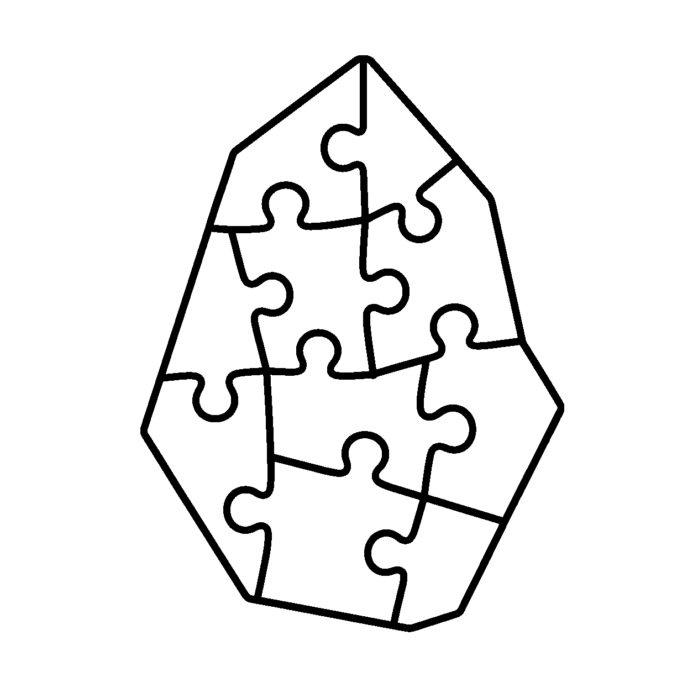

# GenWiki

<p align="center">
  
</p>

<p align="center">
  <strong>An Incremental Personal Knowledge Base using LLMs for Obsidian</strong>
</p>

<p align="center">
  <a href="https://github.com/yvonshong/genwiki/actions/workflows/release.yml"></a>
  <a href="https://github.com/yvonshong/genwiki/releases"></a>
  <a href="LICENSE"></a>
  
</p>

---

GenWiki is an Obsidian plugin inspired by **Andrej Karpathy's "LLM Wiki" concept**. It aims to solve the limitations of traditional RAG (Retrieval-Augmented Generation) systems—where search is ephemeral and knowledge doesn't compound—by using LLMs to incrementally build, structure, and audit a persistent personal knowledge base directly within your vault.

Unlike standard search tools, GenWiki parses your web clippings, merges new findings with your existing notes, structures them with bidirectionally-linked wiki files, and continuously audits your knowledge base for conflicts and gaps.

---

## 🌟 Core Features

### 1. Incremental Ingest (📥 Ingest Clippings)
* **Scan & Parse**: Scans your unprocessed clippings directory for raw web clippings.
* **Smart Merge**: Employs LLMs to read the new source material, look up your existing knowledge index, and decide whether to **modify and merge** existing Wiki pages or **create new ones**.
* **Automatic Linking**: Dynamically formats Obsidian internal WikiLinks (`[[Entity_Name]]`) to connect concepts automatically.
* **Audit Trail**: Archives the original clippings and registers audit logs to `wiki/log.md`.

### 2. Conversational Sidebar (💬 Chat Panel)
* **Contextual Q&A**: Asks questions based on your local compiled wiki. The plugin performs a fast, local index lookup to retrieve the top 5 most relevant wiki pages and feeds them to the LLM.
* **Source Citations**: Answers are fully referenced with standard wikilinks pointing to the source note (e.g., `[[Tool_Obsidian#Features]]`).
* **Wiki Solidification (Save to Wiki)**: Explored insights or deep syntheses from your chats can be instantly **saved as a permanent Wiki note** with a single click. The plugin uses LLM to de-conversationalize the chat, creates aliases/summaries, and updates the local metadata index.

### 3. Knowledge Base Linter (🔍 Lint Wiki)
* **Auditing**: Performs health checks across your active Wiki nodes in batches.
* **Issues Detected**:
  * **Contradictions**: Highlights conflicts where different pages state conflicting facts.
  * **Orphans**: Detects isolated files that lack any inbound WikiLinks.
  * **Stale Pages**: Spots blank or underdeveloped placeholders.
* **Audit Report**: Outputs a thorough report containing precise improvement recommendations.

---

## 🛠️ Architecture & Data Flow

GenWiki enforces a clean three-tier structure inside your `wiki/` directory:

```text
wiki/
├── _skills/           # Modular Agent Prompts (Ingest.md, Query.md, Lint.md, SavePage.md)
├── _agents/           # System SOP Specifications (CLAUDE.md)
├── _database/         # Flat-file Local Database Index (index.json)
├── index.md           # Visual, card-style personal knowledge map
└── log.md             # Action audit logs
```

### Pure Local Text Database
To bypass iOS sandbox constraints and support frictionless cross-device synchronization (e.g., via iCloud, Git, or Obsidian Sync), all indexing metadata (aliases, summaries, backlinks, and claims) is stored in a lightweight flat JSON database (`_database/index.json`). No binary database or server infrastructure is required.

---

## 🚀 Installation

### Manual Installation
1. Download the latest release files (`main.js`, `manifest.json`, `styles.css`) from the [Releases](https://github.com/yvonshong/genwiki/releases) page.
2. Inside your Obsidian vault, navigate to `.obsidian/plugins/` (create the directory if it doesn't exist).
3. Create a subfolder named `genwiki` and paste the three files inside it.
4. Open Obsidian, go to **Settings $\rightarrow$ Community Plugins**, and toggle **GenWiki** on.

---

## ⚙️ Configuration

Open Obsidian Settings and navigate to **GenWiki** under Community Plugins.

1. **LLM Provider**: Choose your preferred model provider:
   * **Google Gemini** (Default: `gemini-3.5-flash`)
   * **Anthropic Claude** (Default: `claude-sonnet-4-6`)
   * **OpenAI** (Default: `gpt-5.4-mini`)
   * **DeepSeek** (Default: `deepseek-v4-flash`, supports OpenAI/Anthropic-compatible endpoints)
   * **Moonshot Kimi** (Default: `kimi-k2.6`)
   * **OpenRouter** (Default: `openrouter/free`, handles unified model endpoints)
2. **Model Selection**: 
   * Select a recommended model from the dropdown.
   * If you wish to use a custom or newly-released model, choose **Custom**, and enter the exact Model ID in the text field that appears.
3. **Paths**: Customize the source directory for raw clippings (default: `Clippings`) and the destination Wiki folder (default: `wiki`).

---

## 📖 How to Use

1. **Setup**: Make sure your API key is configured. On the first startup, GenWiki automatically sets up the folder structure and default Skill templates in your vault.
2. **Start Chatting**: Click the **CPU icon** on the left ribbon to pop open the **GenWiki Chat Panel** on the right side.
3. **Ingest Clippings**: Drop raw Markdown clippings into your `Clippings/` folder, open the Chat Panel, and click **📥 Process Clippings** at the top. The plugin will automatically parse, link, and index them.
4. **Solidify Chat**: Ask questions in the Chat Panel. If the assistant provides a detailed answer you want to keep, click **💾 Save as Wiki Page** beneath the answer to compile it into your permanent knowledge wiki.

---

## 🧑‍💻 Customizing Prompts (Skills)

GenWiki is completely prompt-driven. You can inspect or rewrite the system prompts and instruction flows directly inside your Obsidian editor:
* `wiki/_skills/Ingest.md` — Incremental clipping extraction, linking, and contradiction checks.
* `wiki/_skills/Query.md` — Context retrieval guidelines and link citations.
* `wiki/_skills/Lint.md` — Knowledge audit heuristics.
* `wiki/_skills/SavePage.md` — De-conversationalizing text format rules.

---

## 📄 License

This project is licensed under the [CC BY-NC-SA 4.0 License](LICENSE) (Creative Commons Attribution-NonCommercial-ShareAlike 4.0 International). It is free to share and adapt for non-commercial purposes.
