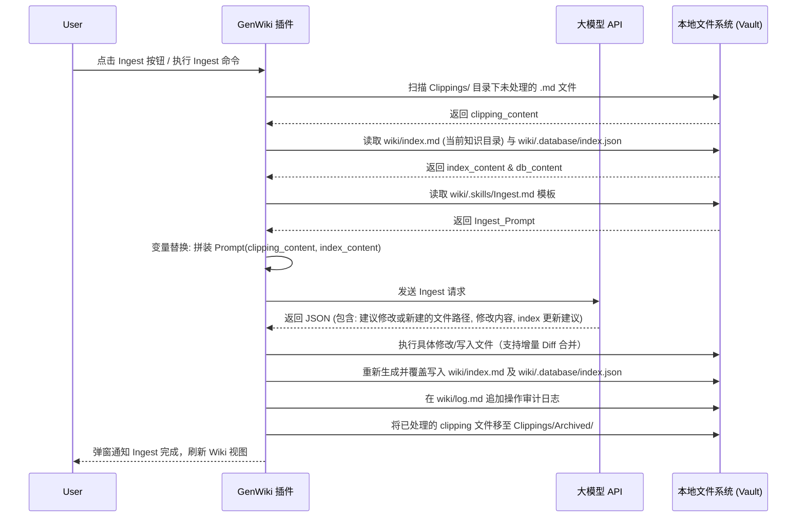
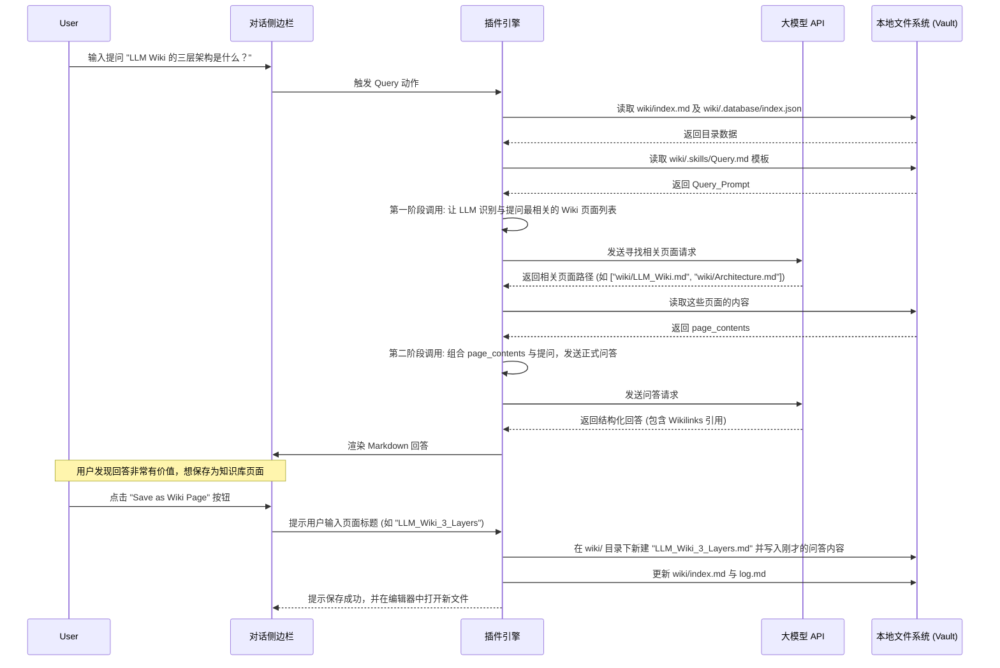
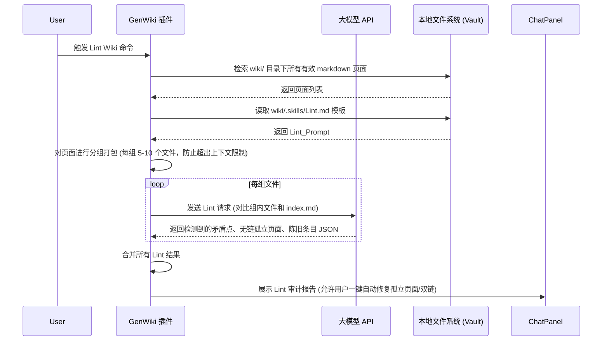
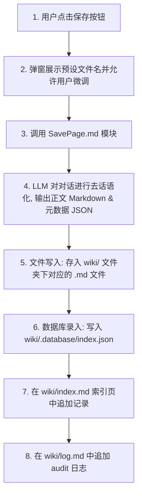

# GenWiki 系统架构与详细方案设计

本设计方案为 GenWiki Obsidian 插件的技术实现蓝图，参考 [llm_wiki_design.md](file:///home/song/Code/Personal/genwiki/llm_wiki_design.md) 中 Karpathy 提出的“增量复利个人知识库”理念，兼顾移动端 (iOS) 的沙盒运行限制，设计为**免后端、纯客户端、Skill 模板驱动**的无状态架构。

---

## 技术开发实现技术栈 (Tech Stack)

为了确保插件能够在桌面端和移动端 (iOS) 完美运行，且代码结构清晰易维护，技术栈选型如下：
* **核心语言**: TypeScript (用于编译生成完全合规的 Obsidian 插件代码)。
* **构建工具**: `esbuild` + `esbuild-assistant` (Obsidian 社区推荐，打包速度快且单文件输出，易于安装到移动端)。
* **网络通信**: Obsidian 内置的 `requestUrl` API (基于 Electron/iOS 原生请求，绕过网页浏览器的跨域限制/CORS)。
* **用户界面 (UI)**: Obsidian 原生 UI 组件 (如 `SettingTab`、`Modal`、`Notice` 等) 与原生 HTML/Vanilla CSS。对话侧边栏使用 **Vanilla JS / Svelte** 实现轻量级无状态渲染，保障在 iOS 上的高性能。

---

## 模块开发优先级与路线图 (Module Priorities & Roadmap)

系统开发将遵循“核心框架先行，逐步增强 UI”的渐进式原则，具体分为三个优先级阶段：

| 优先级阶段 | 模块/功能 | 详细内容 | 交付目标 |
| :--- | :--- | :--- | :--- |
| **P0: 核心框架搭建** | 基础脚手架与配置面板 | 创建 `manifest.json`、`main.ts`；构建 API 密钥设置界面（支持各大模型提供商选择与保存配置）。 | 插件能成功在 Obsidian 桌面端与手机端安装、激活并保存配置。 |
| | 多通道 LLM 适配器 | 实现 Google Gemini、Anthropic、OpenAI、DeepSeek、Kimi、OpenRouter 的基础 HTTP 调用封装。 | 基础 API 连接连通性测试通过。 |
| **P1: 三大核心交互流程** | Ingest 增量导入 | 编写扫描 `Clippings/`、解析 `.skills/Ingest.md`、判断新建/合并文件、更新 `index.json` 元数据、覆盖 `index.md` 索引并写入 `log.md` 审计日志的完整控制链。 | 可通过命令面板或快捷按钮一键整理所有网页剪藏。 |
| | Query 基础检索与问答 | 实现第一阶段 index 检索查找和第二阶段上下文整合问答。支持调用命令行或快捷面板返回问答结果。 | 能够依据 Wiki 知识生成带双链的回答。 |
| | Lint 健康度审计 | 实现分批调用 LLM，检测页面冲突、陈旧信息和孤立页面，生成 Markdown 格式的健康报告。 | Wiki 具有自检纠错与链接补全能力。 |
| **P2: 侧边栏与交互优化** | Chat Panel 对话侧边栏 | 开发 Sidebar 侧边栏活动面板，提供精美的 Markdown 对话界面和实时问答。 | 拥有类似 Claude Code 的全套对话 UI 体验。 |
| | Save-to-Wiki 固化流程 | 在对话框下方渲染“保存为 Wiki”按钮，调用 `SavePage.md` 对话去话语化处理，将新知识写入 Wiki，录入数据库，更新索引并记录审计。 | 对话产生的洞察能够一键转换为正式知识页并入库。 |

---


## 1. 系统整体架构 (System Architecture)

```mermaid
graph TD
    subgraph Obsidian Frontend (Plugin UI)
        Ribbon[一键 Ingest 按钮]
        Command[命令面板 Command Palette]
        ChatPanel[侧边栏 Chat Panel]
    end

    subgraph Core Engine
        Controller[GenWiki 控制器]
        SkillParser[Skill 模板解析器]
        LLMClient[多通道 LLM 适配器]
        WikiIO[文件系统读写 I/O]
    end

    subgraph File Storage (Obsidian Vault)
        Clippings[Clippings/ 网页剪藏]
        WikiDir[wiki/ 知识库]
        Database[wiki/.database/ 索引数据库]
        Skills[wiki/.skills/ Skill Prompt 模板]
        Agents[wiki/.agents/ SOP 协议规范]
        Index[wiki/index.md 目录索引]
        Log[wiki/log.md 审计日志]
    end

    Ribbon --> Controller
    ChatPanel --> Controller
    Command --> Controller

    Controller --> SkillParser
    Controller --> LLMClient
    Controller --> WikiIO

    SkillParser --> Skills
    Controller --> Agents
    WikiIO --> Clippings
    WikiIO --> WikiDir
    WikiIO --> Database
    WikiIO --> Index
    WikiIO --> Log

    LLMClient -->|HTTPS Fetch / requestUrl| CloudLLM[云端大模型 API: Gemini/Anthropic/OpenAI/DeepSeek/Kimi/OpenRouter]
```

---

## 2. 数据库设计 (Database Spec)

由于 iOS 平台的沙盒机制，插件无法使用 SQLite 等二进制数据库。为了实现对**剪藏源文件（Clippings）**和 **Wiki 页面**的全面管理，我们设计了一个基于平面 JSON 的轻量级本地文件数据库，保存在 `wiki/.database/index.json` 中。它包含三个核心模块：**系统元数据**、**源文件管理（Clippings）**、以及 **Wiki 页面关联与状态生命周期**。

### 2.1 数据库结构 (JSON Schema)

```json
{
  "version": "1.0.0",
  "last_indexed": "2026-06-06T00:50:00Z",
  "clippings": {
    "Clippings/Karpathy_LLM_Wiki_Gist.md": {
      "path": "Clippings/Karpathy_LLM_Wiki_Gist.md",
      "sha256": "e3b0c44298fc1c149afbf4c8996fb92427ae41e4649b934ca495991b7852b855",
      "ingest_date": "2026-06-06T00:48:12Z",
      "status": "processed", // "unprocessed" | "processed" | "failed"
      "destinations": [
        "wiki/LLM_Wiki.md",
        "wiki/Entity_Karpathy.md"
      ]
    }
  },
  "wiki_pages": {
    "wiki/LLM_Wiki.md": {
      "path": "wiki/LLM_Wiki.md",
      "title": "LLM Wiki",
      "aliases": ["llm-wiki", "AI知识库"],
      "type": "concept", // "concept" | "entity" | "general"
      "summary": "一种基于大模型增量构建、维持的持久化个人知识库模式，核心是让知识可复利积累。",
      "status": "active", // "draft" | "active" | "stale" | "contradicted" | "archived"
      "last_updated": "2026-06-06T00:50:00Z",
      "sha256": "5c689d2c98a3c... (当前Wiki页面的hash，用于检测人手动编辑冲突)",
      "links_to": [
        "wiki/Entity_Karpathy.md"
      ],
      "links_from": [],
      "claims": [
        {
          "clipping_path": "Clippings/Karpathy_LLM_Wiki_Gist.md",
          "line_range": "10-25",
          "paragraph_summary": "传统RAG机制在每次问答时重新从零拼凑，没有积累，而LLM Wiki是增量编译的知识复利。"
        }
      ],
      "audit": {
        "created_at": "2026-06-06T00:48:15Z",
        "last_compiled_cost_usd": 0.015,
        "history": [
          {
            "timestamp": "2026-06-06T00:48:15Z",
            "action": "create",
            "trigger": "ingest",
            "source": "Clippings/Karpathy_LLM_Wiki_Gist.md"
          }
        ]
      }
    }
  }
}
```

### 2.2 字段管理功能说明

1. **源文件管理 (clippings)**:
   * **`sha256` 校验**: 用于检查剪藏源文件内容是否发生改变。如果源文件内容被修改，插件会判定关联的 Wiki 页面进入 `stale`（陈旧）状态，需要重新导入。
   * **`destinations` 关系链路**: 明确定义当前剪藏文件孕育了哪些 Wiki 页面。若删除源文件，能够精准追溯可能受到影响的 Wiki 页。

2. **Wiki 页面管理 (wiki_pages)**:
   * **生命周期跟踪 (`status`)**:
     * `draft`: 导入中临时生成但尚未通过 Lint 校验的页面。
     * `active`: 正常使用、经过验证的知识点页面。
     * `stale`: 原始 Clippings 发生了改变，或者大模型认为有新数据需要增量同步。
     * `contradicted`: Ingest 过程中，新源文件提供的内容与该页面的现有 claim 冲突。
     * `archived`: 软归档的页面，不再参与 `index.md` 索引的组合。
   * **知识双向引用关系 (`links_to` / `links_from`)**:
     * 自动在后台构建图数据库关联，服务于 Obsidian 局部图谱渲染，同时允许大模型在第一阶段快速发现出站/入站死链（Dead Links）。
   * **精确事实凭证及溯源 (`claims`)**:
     * 记录该 Wiki 页面内核心事实（每段/句结论）对应源文件中的**精确行号范围 (`line_range`)**。用户随时可以在阅读 Wiki 时点击溯源至原始 Clippings 对应位置。


---

## 3. 核心交互三大流程详细设计 (Core Workflows)

### 3.1 Ingest (增量导入流程)



### 3.2 Query (智能对话与固化流程)



### 3.3 Lint (智能健康检查流程)



---

## 4. 核心 Skill Markdown 模版设计

这三个 Skill 存放在 `wiki/.skills/` 中，插件可使用标准的 `YAML frontmatter` 对 Skill 的元数据进行声明。

### 4.1 `wiki/.skills/Ingest.md`

```markdown
---
name: Ingest
description: 提取剪藏源文件，融合合并至已有知识库中。
version: 1.0.0
---

# System Prompt
你是一名严谨的个人知识库整理专家。你的任务是阅读给定的剪藏文章内容，提取出关键的实体、概念、结论，并将它们有条理地合并到已有的 Wiki 知识库目录中。

请严格遵守以下 SOP 规范：
1. **合并优先**：首先检查“已有知识目录列表”，判断是否有高度相关的话题/实体页面。如果有，你应该生成对其进行的修改方案；如果完全没有，才建议创建新页面。
2. **生成双链**：新生成或更新的文章内容中，涉及其他知识库已有的实体或概念时，必须使用 Obsidian 双链格式（如 `[[Entity_Name]]`）。
3. **元数据**：必须提供简明扼要的一句话 Summary 描述该实体或概念。
4. **标记矛盾**：如果新剪藏的信息与已有知识库页面里的内容存在矛盾，必须在输出中显式标记出来，并在冲突页面上方加上 `> [!WARNING] 矛盾警告：`。

# Input Context
## 已有知识目录列表 (wiki/index.md)
{{index_content}}

## 待导入剪藏内容 (Clipping)
{{clipping_content}}

# Output Format
请务必返回以下 JSON 格式数据，不要包含任何额外的 markdown 标记（如 ```json 等包裹）：
{
  "operations": [
    {
      "action": "modify", // "modify" 或者是 "create"
      "path": "wiki/Entity_Karpathy.md",
      "title": "Andrej Karpathy",
      "content": "# Andrej Karpathy\n...\n这里是更新后的完整 Markdown 内容（须包含 [[Obsidian]] 等双链）..."
    }
  ],
  "index_updates": [
    {
      "path": "wiki/Entity_Karpathy.md",
      "summary": "更新后的一句话总结描述..."
    }
  ],
  "contradictions": [
    {
      "page": "wiki/LLM_Wiki.md",
      "reason": "新文章指出纯 context 方案上限在 100k tokens 左右，与之前页面中记录的无限扩展冲突。"
    }
  ]
}
```

### 4.2 `wiki/.skills/Query.md`

```markdown
---
name: Query
description: 对话引擎，从索引列表中定位并问答。
version: 1.0.0
---

# System Prompt
你是一个智能 Wiki 问答助理。你的任务是根据用户提供的相关 Wiki 页面内容，回答用户的问题。
你必须确保：
1. **只基于给定的页面内容回答**，如果内容中不包含答案，请直接说“知识库中暂无相关记录，建议导入新剪藏”。
2. **标明出处**：在回答的关键句末尾，使用类似 `[[Page_Name#Section]]` 的方式标注引用的知识库页面。
3. **保持 Obsidian 格式**：回答直接使用 Markdown 格式，保留段落排版。

# Input Context
## 用户提问
{{user_question}}

## 相关 Wiki 页面内容
{{page_contents}}

# Output Format
请直接输出 Markdown 格式的回答正文，在句末添加相应的 `[[双链引用]]`。
```

### 4.3 `wiki/.skills/SavePage.md`

```markdown
---
name: SavePage
description: 将对话问答内容去话语化，提炼为标准的 Wiki 页面。
version: 1.0.0
---

# System Prompt
你是一名 Wiki 页面精炼专家。你的任务是读取用户的提问与对应的助手回答，将其转化为一篇格式规范、客观陈述、结构清晰的 Wiki 知识库 Markdown 页面。

请遵守以下转换规则：
1. **去话语化**：移除所有诸如“好的，为您解答如下：”、“当然可以，对比发现...”等聊天口吻或寒暄语。
2. **规范命名与大纲**：主标题使用 `#` 等级，内部使用 `##` 和 `###` 进行语义划分。
3. **保留并修正双链**：保留原回答中的 `[[双链引用]]`，并基于你的全局知识对链接名称进行标准化（例如 `[[Andrej Karpathy]]`）。
4. **生成摘要与别名**：生成适合 Obsidian Frontmatter 格式的 `aliases`（别名列表）和一句话 `summary`。

# Input Context
## 用户提问
{{user_question}}

## 原始回答内容
{{assistant_answer}}

# Output Format
请严格返回以下 JSON 格式数据，不要包含任何额外的 Markdown 包裹：
{
  "title": "LLM_Wiki_3_Layers", // 推荐的文件标题名
  "frontmatter": {
    "aliases": ["LLM Wiki架构", "知识库三层模型"],
    "summary": "由原始资料、Wiki层、Schema行为协议构成的三层AI知识库设计体系。"
  },
  "content": "# LLM Wiki 架构\n...\n这里是去话语化整理后的 Markdown 正文内容..."
}
```

### 4.4 `wiki/.skills/Lint.md`

```markdown
---
name: Lint
description: 知识健康度体检，寻找冲突、陈旧信息和孤立节点。
version: 1.0.0
---

# System Prompt
你是一名知识库审计员。你的任务是对比输入的 Wiki 页面群组，找出以下几类健康问题：
1. **信息矛盾 (Contradiction)**：不同的页面对同一个事实、数据有不同的描述（例如，一个写指标为22，另一个写为23）。
2. **孤立节点 (Orphan)**：该页面没有任何入站（Inbound）双链引用，容易在日常浏览中迷失。
3. **陈旧或空白页面 (Stale)**：内容过于空洞或被标记为需要补充的空白页面。

# Input Context
## 待体检 Wiki 页面集
{{group_pages}}

# Output Format
请严格返回以下 JSON 格式数据，不要包含任何额外的包裹或说明：
{
  "contradictions": [
    {
      "files": ["wiki/Resume_2026.md", "wiki/Project_Alpha_Retro.md"],
      "description": "关于 Alpha 项目的性能指标数据不一致，一处标为 22fps，另一处为 23fps。"
    }
  ],
  "orphans": [
    "wiki/Draft_Concept.md"
  ],
  "suggestions": [
    "建议在 wiki/LLM_Wiki.md 中添加对 wiki/Draft_Concept.md 的双链引用。"
  ]
}
```

---

## 5. 交互界面设计 (UI/UX Design)

### 5.1 Ribbon Icon (快捷触发按钮)
* Obsidian 侧边栏添加一个带有 `GenWiki` 图标的按钮。
* 点击后弹出 Dropdown Menu：
  * **⚡ Ingest Clippings**：开始增量导入，展示处理进度条，处理完成后显示通知气泡。
  * **🔍 Lint Wiki**：对 Wiki 文件夹运行全局 Lint，完毕后打开 `wiki/Lint_Report.md`。

### 5.2 Chat Panel (对话侧边栏与固化流程)
* 侧边栏活动页（View Type: `genwiki-chat`）载入对话面板。

#### 1. 固化保存流 (Save-to-Wiki Flow)
当用户在 Chat 中产生高质量问答并点击 **“💾 保存为 Wiki (Save to Wiki)”** 时，系统按照以下严格逻辑运转：



#### 2. 各问题设计规格

* **A. 文件存放在哪？**
  * **保存目录**：统一存放在 `wiki/` 根文件夹下（即 `wiki/[Page_Title].md`），以保持 Wiki 层的文件扁平与统一。
* **B. 是否需要过一遍 LLM 处理？**
  * **必须处理**。对话流中的助手机器人话语（如“如您所愿，我将为您对比...”）和口语表达不适合直接作为百科式 Wiki 页面归档。
  * 插件自动调用 `wiki/.skills/SavePage.md`，将对话转译为结构化、纯粹学术陈述风格的 Markdown 文本，并自动生成 Frontmatter。
* **C. 是否需要录入本地数据库 (DB)？**
  * **必须录入**。新文件保存后，必须立即在本地数据库 `wiki/.database/index.json` 中登记该 Wiki 页面的元数据：
    * `wiki_pages.[path]` 设为新页面路径。
    * 录入大模型返回的 `title`、`aliases`（别名）和 `summary`（摘要）。
    * 将该页的 `status` 标记为 `"active"`。
    * 解析页面中的双链，更新 `links_to` 与其他被引用页面的 `links_from`。
    * 记录 `audit` 日志，追踪知识溯源（Provenance）。
  * 这样能保证下一次 Query 查询或 Lint 体检时，该页面能被检索算法定位并参与全局审计。

